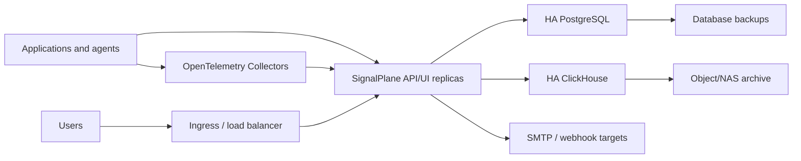

# SignalPlane Silver HA Architecture

Silver HA is built around stateless application replicas, durable metadata storage in PostgreSQL, hot telemetry storage in ClickHouse, and replay queues that protect telemetry during short downstream outages.

## Component Model



## HA Baseline

| Layer | Production pattern |
|---|---|
| SignalPlane | 3 StatefulSet replicas behind a service/ingress |
| Replay queue | One RWO PVC per SignalPlane replica |
| PostgreSQL | Managed HA PostgreSQL, Patroni, CloudNativePG, Crunchy, or customer standard |
| ClickHouse | 3+ nodes with replicated tables and distributed reads |
| Collector | 3 replicas or DaemonSet, spread across zones |
| Ingress | Redundant ingress controller or customer load balancer |
| Storage | Replicated storage class for app PVCs, high-throughput storage for ClickHouse |
| Backup | PostgreSQL PITR, ClickHouse snapshots, object archive lifecycle policy |

## Failure Behavior

### SignalPlane Pod Failure

Kubernetes replaces the pod. Runtime state survives in PostgreSQL. Telemetry already written to ClickHouse remains available. Any telemetry still in the failed pod's replay queue remains on that pod PVC and is replayed when the pod comes back.

### ClickHouse Outage

SignalPlane keeps accepting telemetry and stores runtime state in PostgreSQL. Failed ClickHouse writes are appended to `/data/telemetry-replay.jsonl`. The replay loop retries every 10 seconds. Size replay PVCs for the longest tolerated ClickHouse outage.

Rule of thumb:

```text
replay_pvc_size = peak_raw_ingest_per_hour * outage_hours * 1.5
```

For example, 10 GB/hour peak ingest and a 1-hour tolerated ClickHouse outage needs at least 15 GB replay PVC per active SignalPlane replica.

### PostgreSQL Outage

Runtime state persistence is impacted. SignalPlane should be treated as degraded until PostgreSQL recovers. Production must use PostgreSQL HA with automated failover and tested point-in-time recovery.

### Collector Outage

Applications sending through collectors may buffer or drop based on their SDK and collector configuration. Run multiple collector replicas and use SDK retry where possible.

## Retention And Archival

Default ClickHouse table TTL is 30 days. Use ClickHouse DDL changes or future retention configuration to align with customer policy.

Recommended baseline:

| Data | Hot store | Archive |
|---|---|---|
| Metrics | ClickHouse, 30 days | Object/NAS storage, 180 days |
| Logs | ClickHouse, 30 days | Object/NAS storage, 180 days |
| Traces | ClickHouse, 30 days | Object/NAS storage, 90-180 days |
| PostgreSQL metadata | PostgreSQL | PITR backups, 35+ days |
| Replay queues | PVC per pod | Not archival; drain and monitor |

ClickHouse backups should be stored outside the ClickHouse cluster. Use customer-approved backup tooling, object storage, NFS, NAS, or SAN snapshots.

## Backup Checklist

- PostgreSQL full backup plus WAL/PITR.
- ClickHouse schema backup.
- ClickHouse data backup or volume snapshot.
- Kubernetes Helm values and runtime secret backup.
- TLS certificate and ingress configuration backup.
- Private registry image tags used for the release.

## Restore Order

1. Restore PostgreSQL.
2. Restore ClickHouse schema and data.
3. Restore Kubernetes secrets.
4. Deploy SignalPlane with the same image tag and values.
5. Verify `/healthz`.
6. Verify `/api/system/dependencies`.
7. Query metrics/logs/traces to confirm ClickHouse readback.
8. Trigger a test notification channel.

## Production Monitoring

Monitor:

- SignalPlane pod availability and restarts.
- HTTP 5xx and ingestion latency.
- PostgreSQL connection errors and replication lag.
- ClickHouse insert errors, disk usage, mutation backlog, and query latency.
- Replay queue file size per SignalPlane pod.
- Collector receiver/exporter dropped spans, logs, and metrics.
- Notification delivery failures.
- PVC capacity and inode usage.

## Current HA Limitations

- PostgreSQL runtime state currently persists a snapshot rather than fully normalized control-plane tables.
- OTLP HTTP JSON and OTLP HTTP protobuf are supported; native OTLP gRPC ingestion is handled through OpenTelemetry Collector forwarding.
- Retention is currently configured through ClickHouse schema TTL rather than a runtime UI/API.
- Release migrations are not yet versioned as a formal migration chain.
